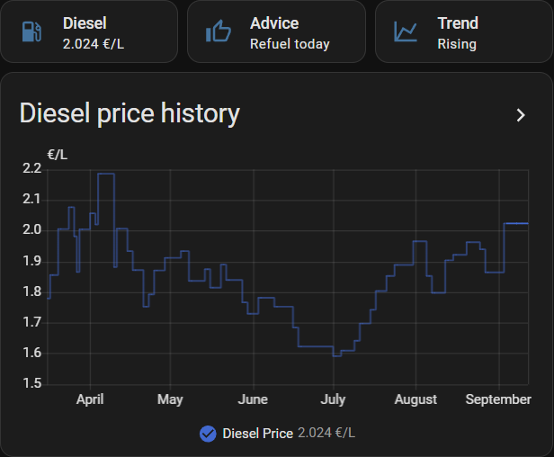
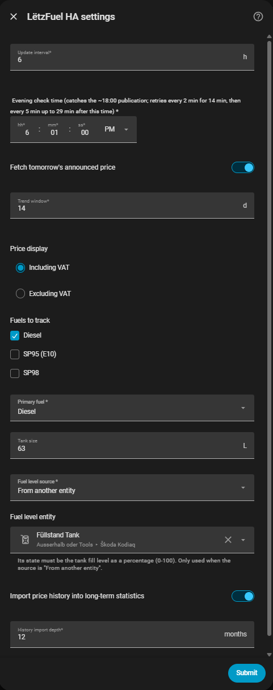

<div align="center">

<picture>
  <source media="(prefers-color-scheme: dark)" srcset="custom_components/letzfuel_ha/brand/dark_logo.png">
  
</picture>

**Luxembourg's regulated maximum fuel prices, trends and refuelling insights for Home Assistant.**

[![Release][release-badge]][release-url] &nbsp; [![HACS][hacs-badge]][hacs-url] &nbsp; [![Validate][validate-badge]][validate-url] &nbsp; [![Tests][tests-badge]][tests-url]

</div>

Luxembourg sets a **single national maximum price** for each road fuel by ministerial
regulation. When the price changes, the new figure is published the evening before it
takes effect (typically around **18:00**). This integration turns that feed into
answers:

- What is the current diesel / SP95 / SP98 price?
- Did the price change today, and by how much?
- Is the price going up or down?
- **A new price was published for tomorrow — should I refuel tonight or wait?**
- What would a full tank cost me right now? What about just topping up?
- How much did the latest price change add to the cost of a full tank?

### Data sources

| Source | Used for |
| --- | --- |
| [petrol.lu](https://www.petrol.lu/en/official-prices/) (GPL) | current price, full history, statistics backfill. |
| [RTL.lu](https://www.rtl.lu/mobiliteit/petrolspraisser) (`api-gate.rtl.lu`) | the **announced next-day price** only. |

> **Not affiliated** with the Groupement Pétrolier Luxembourgeois, petrol.lu, RTL,
> or the Luxembourg government. Always verify the price at the pump.

---

## Features

| Area | What you get |
| --- | --- |
| **Current prices** | `sensor.*_price` for each tracked fuel (€/L, incl. or excl. VAT), with rich attributes |
| **Daily change** | `sensor.*_change` — signed €/L move at the last price change, with percentage and dates |
| **Trend** | `sensor.*_trend` — `rising` / `falling` / `stable` over a configurable window |
| **Next-day awareness** | `binary_sensor.price_change_pending`, `sensor.*_price_tomorrow`, `sensor.refuel_recommendation` |
| **Events** | `letzfuel_ha_price_change_announced` and `letzfuel_ha_price_changed` for automations |
| **Notifications** | one import-and-go [notification blueprint](docs/notifications-blueprint.md) — per-type priority, 6 languages, presence gate |
| **Vehicle analytics** | full-tank / refill / cost-change sensors (when a tank size is set); fuel level from a live `number` slider or read from another entity |
| **Services** | `calculate_fill_cost`, `calculate_trip_cost` (response services) |
| **History** | On setup, past prices are imported into Home Assistant long-term statistics |
| **Robustness** | Diagnostics, repair issues when the source is stale or unparseable |
| **i18n** | English, French, German, Luxembourgish, Portuguese, Italian |

---

## Requirements

Home Assistant **2025.12** or newer.

## Installation

### HACS (recommended)

[](https://my.home-assistant.io/redirect/hacs_repository/?owner=dabo53ck&repository=letzfuel-ha-luxembourg-fuel-monitor&category=integration)

1. Click the button above (or HACS → **Integrations** → menu →
   **Custom repositories**, and add
   `https://github.com/dabo53ck/letzfuel-ha-luxembourg-fuel-monitor` as an
   **Integration**).
2. Install **LëtzFuel HA** and restart Home Assistant.
3. **Settings → Devices & Services → Add Integration → LëtzFuel HA**.

### Manual

Copy `custom_components/letzfuel_ha` into your Home Assistant `config/custom_components`
directory and restart.

---

## Notifications

One import covers all of it — next-day price alerts, "new price in effect",
refuel recommendation and a price-threshold watch. Every type is opt-in, with
per-type priority (including *critical* to bypass Do Not Disturb), a language
picker (English/German/French/Lëtzebuergesch/Português/Italiano) and a
presence gate. Just pick
your phone(s) from a device picker — no notify service to configure.

[](https://my.home-assistant.io/redirect/blueprint_import/?blueprint_url=https%3A%2F%2Fgithub.com%2Fdabo53ck%2Fletzfuel-ha-luxembourg-fuel-monitor%2Fblob%2Fmain%2Fblueprints%2Fautomation%2Fletzfuel_ha%2Fnotifications.yaml)

Full walkthrough: [docs/notifications-blueprint.md](docs/notifications-blueprint.md).

<details>
<summary>Roll your own instead</summary>

Every entity_id is stable and language-independent (e.g.
`sensor.letzfuel_ha_diesel_price`, `sensor.letzfuel_ha_refuel_recommendation`),
so a hand-written automation is straightforward:

```yaml
automation:
  - alias: "Fuel: refuel tonight?"
    triggers:
      - trigger: event
        event_type: letzfuel_ha_price_change_announced
    conditions:
      - condition: template
        value_template: >
          {{ trigger.event.data.changes
             | selectattr('fuel', 'eq', 'diesel')
             | selectattr('direction', 'eq', 'up') | list | count > 0 }}
    actions:
      - action: notify.mobile_app_my_phone
        data:
          title: "Diesel goes up tomorrow"
          message: >
            
            +{{ '%.3f' | format(c.delta) }} €/L from {{ c.effective_date }}.
            Refuel today.
```

</details>

---

## Configuration

All configuration is through the UI.

**Step 1 — Fuels**
: Choose which fuels to track (Diesel, SP95/E10, SP98) and which one is your *primary*
  fuel (used by the recommendation and vehicle sensors).

**Step 2 — Vehicle (optional)**
: Set your tank size to unlock the cost sensors, then choose where the current
  fuel level comes from:
  - **Manual** – a starting level here, then adjust it live from the
    `number.*_current_fuel_level` slider (put it on a dashboard).
  - **From another entity** – pick an entity whose state is the tank fill level
    as a percentage (0–100). The slider is not created in this mode.
    See [Reading the fuel level from another entity](#reading-the-fuel-level-from-another-entity).

**Options** (⚙️ on the integration card) let you change everything below without
re-adding the integration:

| Setting | Default | Notes |
| --- | --- | --- |
| Update interval | 6 h | Regular polling cadence |
| Evening check time | 18:01 | Extra refresh to catch the publication; retries at **+10** and **+20 min** if nothing new appeared |
| Fetch tomorrow's announced price | on | Pull the announced next-day price from RTL.lu (petrol.lu doesn't carry it). Turn off to rely on petrol.lu alone. |
| Trend window | 14 days | Sample window for the trend sensors |
| Price display | Incl. VAT | Show prices with or without VAT |
| Tracked fuels / primary fuel | all / Diesel | |
| Tank size | — | Enables the vehicle sensors |
| Fuel level source | Manual | *Manual* = the `number.*_current_fuel_level` slider; *From another entity* = read it live from the entity below |
| Fuel level entity | — | The entity whose state is the fill level in **percent (0–100)**. Only used when the source is *From another entity* |
| Import price history | on | Backfill long-term statistics |
| History import depth | 12 months | How far back to import |

---

## Entity reference

Entity IDs are prefixed with the device name, e.g. `sensor.letzfuel_ha_diesel_price`.
Sensors marked *disabled by default* can be enabled from the entity settings.
`*_trend` and `*_price_tomorrow` are enabled by default **only for the primary
fuel**; the other tracked fuels' copies start disabled.

> **Language note:** entity names are translated, so on a non-English Home
> Assistant the auto-generated entity IDs follow that language — e.g. on a German
> system the diesel price sensor is `sensor.letzfuel_ha_diesel_preis`,
> the change sensor `..._diesel_anderung`, the recommendation `..._tankempfehlung`.
> The examples below use the English IDs; check **Developer Tools → States** (or
> rename the entities) for yours.

### Per fuel (`diesel`, `sp95`, `sp98`)

| Entity | State | Key attributes |
| --- | --- | --- |
| `sensor.*_<fuel>_price` | current max price, €/L | `currency`, `effective_date`, `price_incl_vat`, `price_excl_vat`, `vat_rate`, `previous_price`, `previous_effective_date`, `price_since`, `next_price`, `next_effective_date`, `source`, `source_url` |
| `sensor.*_<fuel>_change` | signed €/L move at last change | `current_price`, `previous_price`, `percentage_change`, `change_date`, `days_at_current_price` |
| `sensor.*_<fuel>_trend` *(primary fuel on by default)* | `rising` / `falling` / `stable` | `trend_strength` (€/L per week), `trend_window_days`, `samples_used`, `window_start`, `window_end` |
| `sensor.*_<fuel>_price_tomorrow` *(primary fuel on by default)* | announced next-day price or *unknown* | `effective_date`, `change_vs_today`, `direction` |

### Global

| Entity | State | Key attributes |
| --- | --- | --- |
| `binary_sensor.*_price_change_pending` | `on` when a differing next-day price is published | `affected_fuels`, `deltas`, `effective_date` |
| `sensor.*_refuel_recommendation` | `refuel_today` / `wait` / `no_change` / `awaiting_price` | `primary_fuel`, `today_price`, `tomorrow_price`, `delta`, `potential_saving_full_tank` |
| `sensor.*_last_price_update` | timestamp the current price took effect | `last_fetch_success`, `fetched_at`, `source_url` |
| `sensor.*_days_since_last_change` *(disabled by default)* | integer days | — |

### Vehicle (created when a tank size is configured)

| Entity | State | Key attributes |
| --- | --- | --- |
| `number.*_current_fuel_level` | current fuel level, % — a slider you set from a dashboard *(only in **Manual** fuel-level mode)* | — |
| `sensor.*_full_tank_cost` | `tank_size × price`, € | `tank_size`, `fuel_type`, `price_per_liter` |
| `sensor.*_refill_cost` | cost to fill from the current level, € | `current_level_pct`, `tank_size`, `liters_needed`, `price_per_liter`, `level_source`, `level_entity_id` |
| `sensor.*_full_tank_cost_change` | change in full-tank cost from the last price move, € | `old_full_tank_cost`, `new_full_tank_cost`, `difference`, `per_litre_change`, `change_date` |

### Reading the fuel level from another entity

Set **Fuel level source** to *From another entity* (in Step 2 or in Options) and
pick an entity whose **state is the fill level in percent, 0–100**. The refill
sensor then tracks it live, and the `number.*_current_fuel_level` slider is not
created. Anything unusable — the entity missing, `unknown`/`unavailable`, a
non-number, or a value outside 0–100 — leaves `sensor.*_refill_cost` at
*unknown* until a good value arrives.

Typical sources (`sensor`, `number` and `input_number` entities are offered):

- **A car integration's tank sensor** — e.g. MySkoda's *Füllstand Tank*
  (`sensor.<car>_fullstand_tank`); most connected-car integrations (BMW, Kia,
  Tesla, VW/Audi, …) expose an equivalent percentage.
- **An `input_number` helper** you keep up to date yourself or from an
  automation (Settings → Devices & Services → Helpers → *Number*).
- **A template sensor** converting an absolute-litres reading to a percentage:

  ```yaml
  template:
    - sensor:
        - name: Tank level percent
          unit_of_measurement: "%"
          state: "{{ (states('sensor.car_fuel_litres') | float(0) / 55 * 100) | round(0) }}"
  ```

  (replace `55` with your tank size in litres).

> If that entity is later renamed or removed, the stored reference is **not**
> updated automatically — re-pick it in Options.

The level survives restarts, so once you set it you only nudge it after driving
or refuelling.

---

## Services

### `letzfuel_ha.calculate_fill_cost`

| Field | Required | Description |
| --- | --- | --- |
| `liters` | yes | Litres to add |
| `fuel_type` | no | `diesel` / `sp95` / `sp98` (default: primary fuel) |
| `use_tomorrow_price` | no | Use the announced next-day price if available |

Returns `{ cost, liters, price_per_liter, fuel_type, effective_date, currency }`.

### `letzfuel_ha.calculate_trip_cost`

| Field | Required | Description |
| --- | --- | --- |
| `distance_km` | yes | Trip distance |
| `consumption_l_100km` | yes | Average consumption |
| `fuel_type` | no | default: primary fuel |

Returns `{ liters_needed, cost, price_per_liter, fuel_type, currency }`.

---

## Events

`letzfuel_ha_price_change_announced` fires when a next-day price is published that
differs from today:

```yaml
event_type: letzfuel_ha_price_change_announced
data:
  provider: "petrol.lu (Groupement Pétrolier Luxembourgeois)"
  changes:
    - fuel: diesel
      current_price: 1.865
      upcoming_price: 1.889
      delta: 0.024
      direction: up
      effective_date: "2026-09-02"
```

`letzfuel_ha_price_changed` fires the day a new price actually takes effect (same
shape, `old_price` / `new_price`).

---

## 30-day average, month high / low, and derivative trend

The integration deliberately does **not** keep its own price database. Home Assistant's
built-in helpers already do this well, and on setup the published price history is
backfilled into each `sensor.*_price` entity's own long-term statistics — so its
history graph and these helpers have data from before you installed it:

**30-day average** — add a [Statistics helper](https://www.home-assistant.io/integrations/statistics/):

```yaml
sensor:
  - platform: statistics
    name: "Diesel 30-day average"
    entity_id: sensor.letzfuel_ha_diesel_price
    state_characteristic: mean
    max_age:
      days: 30
```

**Month high / low** — same helper with `state_characteristic: value_max` / `value_min`
and `max_age: { days: 31 }` (or use `sampling_size` to taste).

**Smoothed trend** — the [Trend helper](https://www.home-assistant.io/integrations/trend/)
or [Derivative helper](https://www.home-assistant.io/integrations/derivative/) on the
`*_price` sensor.

---

## Screenshots

### Dashboard

Current price, refuel advice and trend at a glance, with a price-history graph
— see the [dashboard card YAML](#dashboard-card-yaml) below to build this.



### Options



### Dashboard card YAML

```yaml
type: vertical-stack
cards:
  - type: grid
    columns: 3
    square: false
    cards:
      - type: tile
        entity: sensor.letzfuel_ha_diesel_price
        name: Diesel
        icon: mdi:gas-station
      - type: tile
        entity: sensor.letzfuel_ha_refuel_recommendation
        name: Advice
        icon: mdi:thumb-up-outline
      - type: tile
        entity: sensor.letzfuel_ha_diesel_trend
        name: Trend
        icon: mdi:chart-line
  - type: history-graph
    title: Diesel price history
    hours_to_show: 4320
    entities:
      - entity: sensor.letzfuel_ha_diesel_price
```

---

## License

[MIT](LICENSE)

<!-- badges -->
[release-badge]: https://img.shields.io/github/v/release/dabo53ck/letzfuel-ha-luxembourg-fuel-monitor?include_prereleases&label=release
[release-url]: https://github.com/dabo53ck/letzfuel-ha-luxembourg-fuel-monitor/releases
[hacs-badge]: https://img.shields.io/badge/HACS-Custom-41BDF5.svg
[hacs-url]: https://github.com/hacs/integration
[validate-badge]: https://github.com/dabo53ck/letzfuel-ha-luxembourg-fuel-monitor/actions/workflows/validate.yml/badge.svg
[validate-url]: https://github.com/dabo53ck/letzfuel-ha-luxembourg-fuel-monitor/actions/workflows/validate.yml
[tests-badge]: https://github.com/dabo53ck/letzfuel-ha-luxembourg-fuel-monitor/actions/workflows/tests.yml/badge.svg
[tests-url]: https://github.com/dabo53ck/letzfuel-ha-luxembourg-fuel-monitor/actions/workflows/tests.yml
