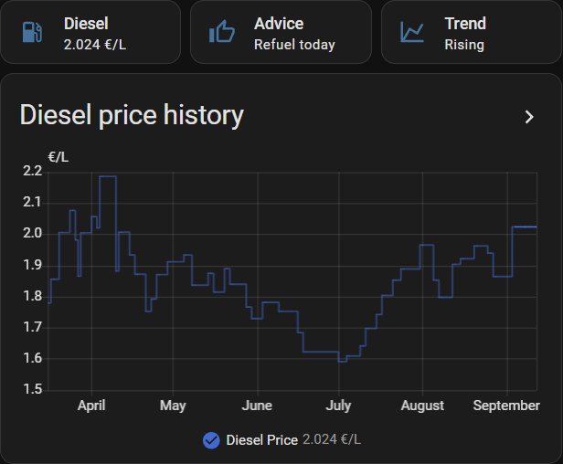
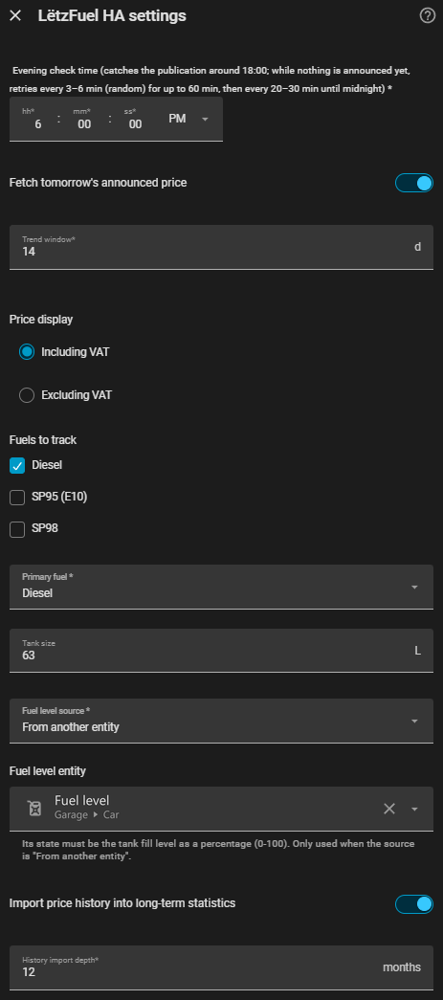

<div align="center">

<picture>
  <source media="(prefers-color-scheme: dark)" srcset="custom_components/letzfuel_ha/brand/dark_logo.png">
  
</picture>

**Luxembourg's regulated maximum fuel prices, trends and refuelling insights for Home Assistant.**

[![Release][release-badge]][release-url] &nbsp; [![HACS][hacs-badge]][hacs-url] &nbsp; [![Validate][validate-badge]][validate-url] &nbsp; [![Tests][tests-badge]][tests-url]

</div>

Luxembourg sets a **single national maximum price** for each road fuel by ministerial
regulation. When the price changes, the new figure is published the evening before it
takes effect (typically around **18:00**). This integration turns that feed into
answers:

- What is the current diesel / SP95 / SP98 price?
- Did the price change today, and by how much?
- Is the price going up or down?
- **A new price was published for tomorrow: should I refuel tonight or wait?**
- What would a full tank cost me right now? What about just topping up?
- How much did the latest price change add to the cost of a full tank?

### Data sources

Prices come from the official maximum-price table published by
[petrol.lu](https://www.petrol.lu/en/official-prices/) (GPL): today's price,
the full history and the statistics backfill.

petrol.lu usually adds the next day's price only late in the evening. To tell
you about a change in time, the integration also checks a public announcement
feed for **tomorrow's price** (nothing else is taken from it). The feed is only
trusted while it agrees with petrol.lu on today's price; if it is unusable, a
backup feed stands in. Implausible values are ignored, and petrol.lu always has
the final say: if its official price turns out different from what was
announced, a correction follows. You can turn this off in the options.

> **Not affiliated** with the GPL, petrol.lu, any other data source or the
> Luxembourg government. Always verify the price at the pump.

---

## Features

| Area | What you get |
| --- | --- |
| **Current prices** | `sensor.*_price` for each tracked fuel (€/L, incl. or excl. VAT), with rich attributes |
| **Daily change** | `sensor.*_change`: signed €/L move at the last price change, with percentage and dates |
| **Trend** | `sensor.*_trend`: `rising` / `falling` / `stable` over a rolling window (see Options) |
| **Next-day awareness** | `binary_sensor.price_change_pending`, `sensor.*_price_tomorrow`, `sensor.refuel_recommendation` |
| **Events** | `letzfuel_ha_price_change_announced`, `letzfuel_ha_price_change_corrected` and `letzfuel_ha_price_changed` for automations |
| **Notifications** | built in: one notification target per person or device, per-type priority, 6 languages, presence gate; a separate [blueprint](https://github.com/dabo53ck/letzfuel-ha-notifications-blueprint) for your own actions and texts |
| **Vehicle analytics** | full-tank / refill / cost-change sensors (when a tank size is set); fuel level from a live `number` slider or read from another entity |
| **Services** | `calculate_fill_cost`, `calculate_trip_cost` (response services) |
| **History** | On setup, past prices are imported into Home Assistant long-term statistics |
| **Robustness** | Diagnostics, repair issues when the source is stale or unparseable |
| **i18n** | English, French, German, Luxembourgish, Portuguese, Italian |

---

## Requirements

Home Assistant **2026.7** or newer.

## Installation

### HACS (recommended)

[](https://my.home-assistant.io/redirect/hacs_repository/?owner=dabo53ck&repository=letzfuel-ha-luxembourg-fuel-monitor&category=integration)

1. Click the button above (or HACS → **Integrations** → menu →
   **Custom repositories**, and add
   `https://github.com/dabo53ck/letzfuel-ha-luxembourg-fuel-monitor` as an
   **Integration**).
2. Install **LëtzFuel HA** and restart Home Assistant.
3. **Settings → Devices & Services → Add Integration → LëtzFuel HA**.

### Manual

Copy `custom_components/letzfuel_ha` into your Home Assistant `config/custom_components`
directory and restart.

---

## Notifications

> **Changed in 0.2.0: notifications are built in.** If you used the
> notifications blueprint before, read
> [Coming from the blueprint](#coming-from-the-blueprint) below, otherwise you
> get every notification twice.

LëtzFuel HA sends the notifications itself: next-day price announcements (with
corrections), "new price in effect", the refuel recommendation, a live
countdown to midnight and a price threshold. Every type is opt-in, with its own
priority (including *critical* to bypass Do Not Disturb), six languages and an
optional presence gate.

**Set it up:** Settings → Devices and services → LëtzFuel HA → **Add
notification**. Give the target a name, pick the phone(s) or tablet(s) with the
Home Assistant Companion app, check the language (Home Assistant's own is
preselected) and open the sections of the types you want. Add one target per
person or device if they want different notifications; each can be edited or
deleted on its own.

| Type | When |
| --- | --- |
| Evening: price announced for tomorrow | a new price is published (around 18:00); a correction replaces it if the official price turns out different |
| New price in effect | the day a new price applies, just after midnight |
| Refuel recommendation | the recommendation changes to a state you picked |
| Live countdown to midnight | a Lock Screen countdown while the recommendation is "Refuel today" |
| Price threshold | a price drops below your target (once, until it goes above again) |

### Coming from the blueprint

Up to 0.1.2 the notifications came from a blueprint. You now have two choices:

1. **Use the built-in notifications (recommended).** Add a notification target
   as above, then turn off or delete your blueprint automation. As long as both
   run, a repair issue reminds you and can turn the automation off for you.
2. **Keep using the blueprint**, for example for your own actions (Telegram,
   TTS, lights) or texts. It moved to its own repository,
   [letzfuel-ha-notifications-blueprint](https://github.com/dabo53ck/letzfuel-ha-notifications-blueprint):
   1. Import it from there.
   2. Open your automation, ⋮ → **Edit in YAML**, and change only the path:
      `use_blueprint: path: dabo53ck/letzfuel_ha_notifications.yaml`. All
      your settings stay.
   3. Delete the old blueprint under **Blueprints**.

   You don't need to delete or recreate the automation.

The old blueprint in this repository still works for now, but gets no new
features and will be removed in a later release.

<details>
<summary>Roll your own instead</summary>

Every entity_id is stable and language-independent (e.g.
`sensor.letzfuel_ha_diesel_price`, `sensor.letzfuel_ha_refuel_recommendation`),
so a hand-written automation is straightforward:

```yaml
automation:
  - alias: "Fuel: refuel tonight?"
    triggers:
      - trigger: event
        event_type: letzfuel_ha_price_change_announced
    conditions:
      - condition: template
        value_template: >
          {{ trigger.event.data.changes
             | selectattr('fuel', 'eq', 'diesel')
             | selectattr('direction', 'eq', 'up') | list | count > 0 }}
    actions:
      - action: notify.mobile_app_my_phone
        data:
          title: "Diesel goes up tomorrow"
          message: >
            
            +{{ '%.3f' | format(c.delta) }} €/L from {{ c.effective_date }}.
            Refuel today.
```

</details>

---

## Configuration

All configuration is through the UI.

**Step 1: Fuels**
: Choose which fuels to track (Diesel, SP95/E10, SP98) and which one is your *primary*
  fuel (used by the recommendation and vehicle sensors). The primary fuel must be
  one of the tracked fuels.

**Step 2: Vehicle (optional)**
: Set your tank size to unlock the cost sensors, then choose where the current
  fuel level comes from:
  - **Manual**: a starting level here, then adjust it live from the
    `number.*_current_fuel_level` slider (put it on a dashboard). The level
    survives restarts, so you only nudge it after driving or refuelling.
  - **From another entity**: pick an entity whose state is the tank fill level
    as a percentage (0-100). The slider is not created in this mode.
    See [Reading the fuel level from another entity](#reading-the-fuel-level-from-another-entity).

Prices refresh every 6 hours, plus the evening check and a refresh just after
midnight.

**Options** (⚙️ on the integration card) let you change everything below without
re-adding the integration:

| Setting | Default | Notes |
| --- | --- | --- |
| Evening check time | 18:00 | Extra refresh to catch the publication; while nothing has been announced yet it retries every **3-6 min** (random) for up to an hour, then every **20-30 min** (random) until midnight |
| Fetch tomorrow's announced price | on | Also ask the announcement feed (or its backup) for the next-day price, so it shows up in the evening. Implausible values are ignored. Turn off to rely on petrol.lu alone. |
| Trend window | 14 days | Sample window for the trend sensors |
| Price display | Incl. VAT | Show prices with or without VAT; also used for the imported price history |
| Tracked fuels / primary fuel | all / Diesel | The primary fuel must be one of the tracked fuels |
| Tank size | - | Enables the vehicle sensors |
| Fuel level source | Manual | *Manual* = the `number.*_current_fuel_level` slider; *From another entity* = read it live from the entity below |
| Fuel level entity | - | The entity whose state is the fill level in **percent (0-100)**. Only used when the source is *From another entity* |
| Import price history | on | Backfill long-term statistics |
| History import depth | 12 months | How far back to import |

---

## Entity reference

Entity IDs are prefixed with `letzfuel_ha_`, e.g. `sensor.letzfuel_ha_diesel_price`.
Sensors marked *disabled by default* can be enabled from the entity settings.
`*_trend` and `*_price_tomorrow` are enabled by default **only for the primary
fuel**; the other tracked fuels' copies start disabled.

> **Language note:** entity names are translated, but entity IDs are always
> English, whatever language Home Assistant runs in, e.g. the diesel price
> sensor is `sensor.letzfuel_ha_diesel_price` everywhere. Entities that already
> exist keep the ID they were created with.

### Per fuel (`diesel`, `sp95_e10`, `sp98`)

| Entity | State | Key attributes |
| --- | --- | --- |
| `sensor.*_<fuel>_price` | current max price, €/L | `currency`, `fuel_type`, `effective_date`, `price_incl_vat`, `price_excl_vat`, `vat_rate`, `previous_price`, `previous_effective_date`, `price_since`, `next_price`, `next_effective_date`, `source`, `source_url` |
| `sensor.*_<fuel>_change` | signed €/L move at last change | `current_price`, `previous_price`, `percentage_change`, `change_date`, `days_at_current_price` |
| `sensor.*_<fuel>_trend` *(primary fuel on by default)* | `rising` / `falling` / `stable` | `trend_strength` (€/L per week), `trend_window_days`, `samples_used`, `window_start`, `window_end` |
| `sensor.*_<fuel>_price_tomorrow` *(primary fuel on by default)* | announced next-day price or *unknown* | `effective_date`, `change_vs_today`, `direction` |

### Global

| Entity | State | Key attributes |
| --- | --- | --- |
| `binary_sensor.*_price_change_pending` | `on` when a differing next-day price is published | `affected_fuels`, `deltas`, `effective_date` |
| `sensor.*_refuel_recommendation` | `refuel_today` / `wait` / `no_change` / `awaiting_price` | `primary_fuel`, `today_price`, `tomorrow_price`, `delta`, `potential_saving_full_tank` |
| `sensor.*_last_price_update` | timestamp the current price took effect | `last_fetch_success`, `fetched_at`, `source`, `source_url` |
| `sensor.*_days_since_last_change` *(disabled by default)* | integer days | - |

### Vehicle (created when a tank size is configured)

| Entity | State | Key attributes |
| --- | --- | --- |
| `number.*_current_fuel_level` | current fuel level, %: a slider you set from a dashboard *(only in **Manual** fuel-level mode)* | - |
| `sensor.*_full_tank_cost` | `tank_size × price`, € | `tank_size`, `fuel_type`, `price_per_liter` |
| `sensor.*_refill_cost` | cost to fill from the current level, € | `current_level_pct`, `tank_size`, `liters_needed`, `price_per_liter`, `level_source`, `level_entity_id` |
| `sensor.*_full_tank_cost_change` | change in full-tank cost from the last price move, € | `old_full_tank_cost`, `new_full_tank_cost`, `difference`, `per_litre_change`, `change_date` |

### Reading the fuel level from another entity

Set **Fuel level source** to *From another entity* (in Step 2 or in Options) and
pick an entity whose **state is the fill level in percent, 0-100**. The refill
sensor then tracks it live, and the `number.*_current_fuel_level` slider is not
created. Anything unusable (the entity missing, `unknown`/`unavailable`, a
non-number, or a value outside 0-100) leaves `sensor.*_refill_cost` at
*unknown* until a good value arrives.

Typical sources (`sensor`, `number` and `input_number` entities are offered):

- **A connected-car integration's tank sensor**: most of them expose the
  fill level as a percentage (e.g. `sensor.<car>_fuel_level`).
- **An `input_number` helper** you keep up to date yourself or from an
  automation (Settings → Devices & Services → Helpers → *Number*).
- **A template sensor** converting an absolute-litres reading to a percentage:

  ```yaml
  template:
    - sensor:
        - name: Tank level percent
          unit_of_measurement: "%"
          state: "{{ (states('sensor.car_fuel_litres') | float(0) / 55 * 100) | round(0) }}"
  ```

  (replace `55` with your tank size in litres).

> If that entity is later renamed or removed, the stored reference is **not**
> updated automatically; re-pick it in Options.

---

## Services

### `letzfuel_ha.calculate_fill_cost`

| Field | Required | Description |
| --- | --- | --- |
| `liters` | yes | Litres to add |
| `fuel_type` | no | `diesel` / `sp95` / `sp98` (default: primary fuel) |
| `use_tomorrow_price` | no | Use the announced next-day price if available |

Returns `{ cost, liters, price_per_liter, fuel_type, effective_date, currency }`.

### `letzfuel_ha.calculate_trip_cost`

| Field | Required | Description |
| --- | --- | --- |
| `distance_km` | yes | Trip distance |
| `consumption_l_100km` | yes | Average consumption |
| `fuel_type` | no | default: primary fuel |

Returns `{ liters_needed, cost, price_per_liter, fuel_type, currency }`.

---

## Events

`letzfuel_ha_price_change_announced` fires when a next-day price is published that
differs from today (for a given fuel and day, once):

```yaml
event_type: letzfuel_ha_price_change_announced
data:
  provider: "petrol.lu (Groupement Pétrolier Luxembourgeois)"
  changes:
    - fuel: diesel
      current_price: 1.865
      upcoming_price: 1.889
      delta: 0.024
      direction: up
      effective_date: "2026-09-02"
```

`letzfuel_ha_price_change_corrected` fires when petrol.lu's official price for a
day turns out different from what was announced for it, the same evening or
after midnight. `current_price` is the price before that day, so `delta` and
`direction` (`up` / `down` / `none`) describe the *real* change:

```yaml
event_type: letzfuel_ha_price_change_corrected
data:
  provider: "petrol.lu (Groupement Pétrolier Luxembourgeois)"
  changes:
    - fuel: diesel
      effective_date: "2026-09-26"
      announced_price: 2.055
      corrected_price: 2.095
      current_price: 2.095
      delta: 0.0
      direction: none
```

`letzfuel_ha_price_changed` fires the day a new price actually takes effect:

```yaml
event_type: letzfuel_ha_price_changed
data:
  provider: "petrol.lu (Groupement Pétrolier Luxembourgeois)"
  changes:
    - fuel: diesel
      old_price: 2.055
      new_price: 2.095
      effective_date: "2026-09-26"
```

---

## 30-day average, month high / low, and derivative trend

The integration deliberately does **not** keep its own price database. Home Assistant's
built-in helpers already do this well, and on setup the published price history is
backfilled into each `sensor.*_price` entity's own long-term statistics, so its
history graph and these helpers have data from before you installed it:

**30-day average**: add a [Statistics helper](https://www.home-assistant.io/integrations/statistics/):

```yaml
sensor:
  - platform: statistics
    name: "Diesel 30-day average"
    entity_id: sensor.letzfuel_ha_diesel_price
    state_characteristic: mean
    max_age:
      days: 30
```

**Month high / low**: same helper with `state_characteristic: value_max` / `value_min`
and `max_age: { days: 31 }` (or use `sampling_size` to taste).

**Smoothed trend**: the [Trend helper](https://www.home-assistant.io/integrations/trend/)
or [Derivative helper](https://www.home-assistant.io/integrations/derivative/) on the
`*_price` sensor.

---

## Screenshots

### Dashboard

Current price, refuel advice and trend at a glance, with a price-history graph.
See the [dashboard card YAML](#dashboard-card-yaml) below to build this.



### Options



### Dashboard card YAML

```yaml
type: vertical-stack
cards:
  - type: grid
    columns: 3
    square: false
    cards:
      - type: tile
        entity: sensor.letzfuel_ha_diesel_price
        name: Diesel
        icon: mdi:gas-station
      - type: tile
        entity: sensor.letzfuel_ha_refuel_recommendation
        name: Advice
        icon: mdi:thumb-up-outline
      - type: tile
        entity: sensor.letzfuel_ha_diesel_trend
        name: Trend
        icon: mdi:chart-line
  - type: history-graph
    title: Diesel price history
    hours_to_show: 4320
    entities:
      - entity: sensor.letzfuel_ha_diesel_price
```

---

## License

[MIT](LICENSE)

<!-- badges -->
[release-badge]: https://img.shields.io/github/v/release/dabo53ck/letzfuel-ha-luxembourg-fuel-monitor?include_prereleases&label=release
[release-url]: https://github.com/dabo53ck/letzfuel-ha-luxembourg-fuel-monitor/releases
[hacs-badge]: https://img.shields.io/badge/HACS-Custom-41BDF5.svg
[hacs-url]: https://github.com/hacs/integration
[validate-badge]: https://github.com/dabo53ck/letzfuel-ha-luxembourg-fuel-monitor/actions/workflows/validate.yml/badge.svg
[validate-url]: https://github.com/dabo53ck/letzfuel-ha-luxembourg-fuel-monitor/actions/workflows/validate.yml
[tests-badge]: https://github.com/dabo53ck/letzfuel-ha-luxembourg-fuel-monitor/actions/workflows/tests.yml/badge.svg
[tests-url]: https://github.com/dabo53ck/letzfuel-ha-luxembourg-fuel-monitor/actions/workflows/tests.yml
