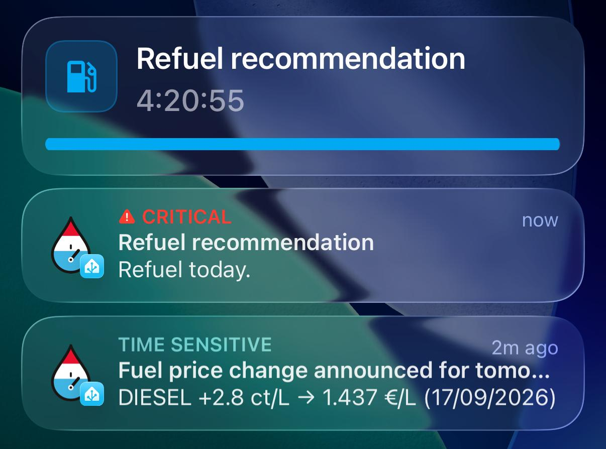

# Notification blueprint

`blueprints/automation/letzfuel_ha/notifications.yaml` is one automation that
turns LëtzFuel HA's events and sensors into phone notifications. Every
notification type is **opt-in** and lives in its own collapsible section — you
pick your device(s) and language once, enable the types you want, and you're
done. Message text is fixed per language (English, German, French,
Lëtzebuergesch, Português, Italiano); there's nothing to write.

- [Requirements](#requirements)
- [Install](#install)
- [Language](#language)
- [Notification delivery](#notification-delivery)
- [Grouping](#grouping)
- [Tapping a notification](#tapping-a-notification)
- [Priority and Do Not Disturb](#priority-and-do-not-disturb)
- [The notification types](#the-notification-types)
  - [Evening: next-day price announced](#evening-next-day-price-announced)
  - [New price in effect](#new-price-in-effect)
  - [Refuel recommendation](#refuel-recommendation)
  - [Live countdown to midnight](#live-countdown-to-midnight)
  - [Price threshold](#price-threshold)
- [Only when home / away](#only-when-home--away)
- [Worked configurations](#worked-configurations)
- [Troubleshooting](#troubleshooting)

---

## Requirements

- Home Assistant **2025.12** or newer.
- The [Home Assistant Companion app](https://companion.home-assistant.io/) on
  every phone/tablet you want to notify — the blueprint only targets paired
  companion-app devices.
- For **critical** notifications:
  - **iOS** – allow *Critical Alerts* for the Home Assistant app
    (iOS Settings → Notifications → Home Assistant → Critical Alerts). Without
    this, iOS silently downgrades a critical alert to time-sensitive.
  - **Android** – nothing to enable; critical uses the companion app's built-in
    *Alarm stream* channel, which plays at alarm volume and ignores Do Not
    Disturb.

## Install

[](https://my.home-assistant.io/redirect/blueprint_import/?blueprint_url=https%3A%2F%2Fgithub.com%2Fdabo53ck%2Fletzfuel-ha-luxembourg-fuel-monitor%2Fblob%2Fmain%2Fblueprints%2Fautomation%2Fletzfuel_ha%2Fnotifications.yaml)

1. Click the button above (or in Home Assistant: **Settings → Automations &
   Scenes → Blueprints → Import Blueprint**, and paste:
   ```
   https://github.com/dabo53ck/letzfuel-ha-luxembourg-fuel-monitor/blob/main/blueprints/automation/letzfuel_ha/notifications.yaml
   ```
   ).
2. **Create Automation** from the blueprint.
3. Open **Language**, pick your language, then **Notification delivery**,
   pick your device(s), then open the sections for the notifications you
   want and switch **Enable** on.

To pick up a later fix: **Blueprints → ⋮ on the blueprint → Re-import**.

## Language

One input, **Notification language**, picks which of the six fixed text sets
(English, German, French, Lëtzebuergesch, Português, Italiano) is used for
every notification's title and message — decimal numbers switch between `.`
and `,` along with it.
This is independent of Home Assistant's own UI language: the blueprint's
*input* labels (section names, field descriptions) always stay English,
because Home Assistant has no mechanism to translate a blueprint's own UI.
Default is English.

### Versioning

Home Assistant has no built-in blueprint version tracking or update check —
re-importing always silently overwrites whatever you had. The blueprint's
`description` (visible on the Blueprints page and while editing an automation
built from it) carries a version marker and a one-line summary of what
changed, so you can tell at a glance whether you're on the latest — the
blueprint's title itself is deliberately version-free and stays stable.
From `0.0.1-beta` on, that marker follows the integration's own release
number instead of the earlier separate v1–v7 counter, so both stay in sync.
Check [`CHANGELOG.md`](../CHANGELOG.md) for the full history.

Re-importing a new version does **not** touch inputs you already set on
automations built from it (device picks, enabled types, …) — except where a
version note says otherwise (e.g. v2 renamed the delivery input, so it comes
back empty and needs to be re-picked once).

## Notification delivery

One input, **Devices**, decides where everything goes: a device picker
pre-filtered to your paired Home Assistant Companion app devices. Pick one or
several — there's no notify service name to look up. Every enabled type is
sent to every selected device.

## Tapping a notification

Tapping a notification opens something useful instead of just the app:

| Notification | Opens |
| --- | --- |
| Price change announced / new price in effect | the price sensor of the (first) fuel it's about |
| Price threshold | the price sensor of the fuel that dropped below your target |
| Refuel recommendation and Live countdown | the *Refuel recommendation* sensor |

That opens Home Assistant's details dialog for the entity, with its history
graph. If you'd rather land on your own dashboard, fill in the optional
**Dashboard opened when you tap a notification** input under *Notification
delivery* — a view path like `/lovelace/fuel` or `/dashboard-fuel/overview` —
and every notification opens that instead.

Under the hood the blueprint sends both the iOS (`url` / `entity_id`) and the
Android (`clickAction`) fields, so it works the same on both.

## Grouping

Every notification carries `group: letzfuel_ha` (Android) and
`push.thread-id: letzfuel_ha` (iOS), so they collapse into one stack on the
phone instead of scattering. This is fixed and has no setting.

Within that, each **type** uses its own fixed tag (`letzfuel_announced`,
`letzfuel_effective`, `letzfuel_recommendation`, `letzfuel_threshold`), so a
newer message of the same type **replaces** the previous one rather than
stacking. These tags are hardcoded and have no setting.

The four types above also carry the LëtzFuel brand icon (served locally by
the integration) instead of the generic Home Assistant icon — nothing to
configure. The *Live countdown* below doesn't get it: iOS Live Activities only
support a Material Design Icon, not a custom image (see its own note below).

## Priority and Do Not Disturb

Each notification type has a **Priority** dropdown:

| Priority | Android | iOS |
| --- | --- | --- |
| **Normal** | default channel | default |
| **Elevated** | `importance: high`, `priority: high` | `interruption-level: time-sensitive` |
| **Critical** | `channel: alarm_stream` – alarm volume, **bypasses Do Not Disturb** | `interruption-level: critical` + critical sound – **bypasses the silent switch and Focus** |

Notes:

- iOS critical needs the one-time permission in [Requirements](#requirements).
- Android `alarm_stream` is loud. Use it only where you mean it — e.g. the
  *announced* type with **Direction: Increases only** and a real
  **Minimum change**.
- A **critical** notification also ignores the
  [presence gate](#only-when-home--away) by default ("Critical notifications
  ignore the presence gate").

## The notification types

Titles and messages are fixed for every type, in whichever
[language](#language) you picked (see the source blueprint if you want to
fork it and change the wording); the inputs below only control *whether* and
*when* each type fires.

### Evening: next-day price announced

Fires on the `letzfuel_ha_price_change_announced` event — a new price has been
published for tomorrow (Luxembourg publishes around 17:30–18:00 the day before). The
message shows the date it takes effect in Luxembourg's regional format,
`DD/MM/YYYY` (e.g. `SP95 −2,8 ct/L → 1,84 €/L (10/09/2026)`) — fixed, not a
setting.

| Input | Meaning |
| --- | --- |
| **Fuels** | Which fuels to notify about. *Primary fuel* follows the integration's configured primary fuel. |
| **Direction** | Up and down / increases only / decreases only. |
| **Minimum change** | Ignore moves smaller than this (€/L). `0` = any change. |
| **Priority** | See [above](#priority-and-do-not-disturb). |

**Corrections.** If petrol.lu's official price for that day later turns out
different from what was announced (`letzfuel_ha_price_change_corrected`), a
correction is sent with the same settings — only for a fuel and change you were
actually notified about — and replaces the earlier notification on the phone,
e.g. `DIESEL: 2.095 €/L (no change) instead of 2.055 €/L (26/09/2026)`.

### New price in effect

Same inputs as *announced*, but fires on `letzfuel_ha_price_changed` — the day a
new price **actually applies** (usually just after midnight).

### Refuel recommendation

Fires when `sensor.letzfuel_ha_refuel_recommendation` changes. Nothing to
configure beyond enabling it — the blueprint always watches that one, stable
entity.

| Input | Meaning |
| --- | --- |
| **Notify when it becomes** | Which *actionable* states notify: `refuel_today`, `wait`. Default: `refuel_today` only. |
| **Also notify when there is no recommendation** | Off by default. On = also notify when the recommendation settles on `no_change` (tomorrow's price brings nothing to do). The `awaiting_price` state (no next-day price published yet) never notifies. |

> If you renamed that entity in your own install, this section won't fire —
> fork the blueprint and change the hardcoded entity id (search for
> `sensor.letzfuel_ha_refuel_recommendation` in the YAML).

### Live countdown to midnight

Off by default and **additional** to *Refuel recommendation* above, not a
replacement — if you have both enabled, you get the normal push *and* this.

Starts a Live Activity (iOS) / Live Update (Android) the moment the
recommendation becomes `refuel_today`, counting down to the midnight
rollover when the higher price takes effect; ends automatically once the
recommendation moves off `refuel_today` (normally the integration's
just-after-midnight refresh, well before the platform's own 8-hour limit
kicks in).



| Input | Meaning |
| --- | --- |
| **Enable** | Off by default. |

Shows a fixed `mdi:gas-station` icon, not the LëtzFuel brand icon — iOS Live
Activities only support a Material Design Icon (optionally tinted with a hex
color), not a custom image, so there's no `icon_url` equivalent here.

Confirmed working on both iOS (Live Activity) and Android (Live Update).
Needs a Companion App version with Live Activity / Live Update support
(**iOS 17.2+**, **Android 16+**). What an older app version does with the
extra notification fields hasn't been broadly verified — if in doubt, try
it and watch the automation trace / your Lock Screen rather than assuming.
No language-specific text beyond the existing *Refuel recommendation*
strings; no priority setting (Live Activities don't have one) and no
[presence gate](#only-when-home--away) — both intentionally left out of
this first version.

### Price threshold

Fires when a watched price sensor drops **below** a value you set — "tell me
when diesel is under 1.60".

| Input | Meaning |
| --- | --- |
| **Fuels** | Which fuels to watch. Same picker as *announced*/*effective*: *Primary fuel* follows the integration's configured primary fuel. |
| **Notify when the price is below** | Your target €/L, applied to every selected fuel. Leave at `0` until you enable this section (a `0` threshold never fires). |

> A fuel you don't track in the integration simply never triggers here —
> nothing to configure, it activates on its own if you start tracking it
> later.

## Only when home / away

Optional presence gate.

| Input | Meaning |
| --- | --- |
| **Person or group** | A `person` or a `group` of persons. Leave empty to disable the gate even if the section toggle is on. |
| **Send only when** | `Home` or `Away`. |
| **Critical notifications ignore the presence gate** | Default on. |

## Worked configurations

**"Just tell me when to refuel."**
Delivery: your phone. Enable *Evening: next-day price announced* → Fuels
*Primary fuel*, Direction *Up and down*, Priority *Normal*. Nothing else.

**Power user.**
Also enable *New price in effect* (Priority *Elevated*) and *Refuel
recommendation* → `refuel_today`.

**Critical only for a real hike.**
Enable *Evening: next-day price announced* → Direction *Increases only*,
Minimum change `0.03`, Priority *Critical*. Leave every other type off.

## Troubleshooting

| Symptom | Cause / fix |
| --- | --- |
| No notification at all | Confirm the device is picked in **Devices** and still paired (Settings → Companion App). Check the automation trace (Automations → ⋮ → Traces). |
| Notifications don't group | Shouldn't happen — grouping is fixed and not user-configurable. Check the trace for the `notification_data` variable. |
| *Critical* doesn't pierce Do Not Disturb | iOS: *Critical Alerts* not allowed for the HA app. Android: another app owns a Do-Not-Disturb override, or the phone blocks the alarm channel. |
| Announced/effective/threshold never fires | No price change has been published yet, or your **Fuels / Direction / Minimum change** filtered it out. Confirm the `letzfuel_ha_price_change_announced` event in Developer Tools → Events. |
| Refuel recommendation never fires | You renamed `sensor.letzfuel_ha_refuel_recommendation` — see the note in [Refuel recommendation](#refuel-recommendation). |
| Live countdown never appears, or shows as a normal push instead | Your Companion App version/OS likely doesn't support Live Activities/Live Updates yet (needs iOS 17.2+ / Android 16+ and a recent app build) — the extra data fields are then presumably ignored, falling back to a plain notification, though this fallback hasn't been broadly verified. Check the trace for the `recommend` trigger — the second `choose:` action's conditions confirm whether the automation itself tried. |
